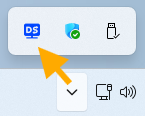
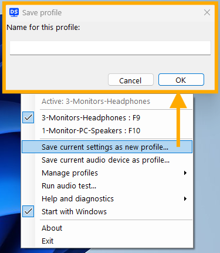
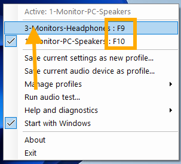
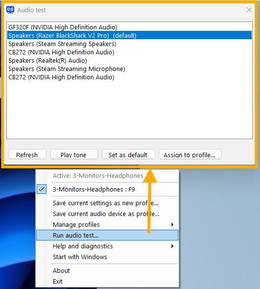
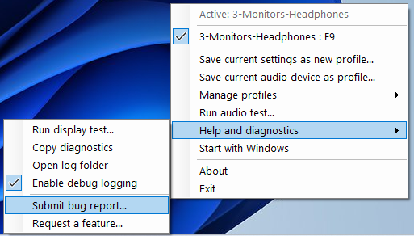

# Display Selector

A lightweight **Windows 11** system-tray utility that captures your current **display layout + audio device** as a named `Profile` and binds it to a **global hotkey** — switching displays, sound, or both with one keypress.

> [!TIP]
> Yes, **sound** can be switched independently of any **display** `Profile`!

## Why

One PC, several setups — e.g. a multi-monitor desk, a single TV for couch gaming with a soundbar, a single desk monitor with PC speakers. Switching between them in Windows-default tooling means juggling the main display, the sound device, and powering panels on/off.   **Display Selector** turns all of that into one keypress.

## Features

- **Capture your setup as a `Profile`** — the display layout (which monitors are active, which is primary, plus resolution and orientation) *and* the default audio device, saved under a name you choose.
- **Audio-only `Profile`(s)** — switch just the sound device, independent of any display change.
- **Switch with one keypress** — a global hotkey (or the tray menu) rearranges your displays and changes the audio device in a single step; works from the desktop or inside an app/game.
- **Audio follows everywhere** — apps *and* System Sounds move to the new device (no more "System Sounds stuck on the old one").
- **Rebindable global hotkeys** — F9–F12 by default, remappable to any key + Ctrl/Alt/Shift, with conflict detection.
- **Focus mode** — leave a panel out of a `Profile` to let it drop to low power, e.g. a multi-monitor → single-monitor switch.
- **Lives in the system tray** — optionally starts with Windows; the active `Profile` shows in the menu, and every action is reachable via the system tray menu.

## Install & Uninstall

Download the installer `DisplaySelectorSetup.exe` from [Releases](https://github.com/funkergreg/display-selector/releases) and run it. It's a **per-user** install (no admin needed).

> [!NOTE]
> The app is unsigned, so Windows SmartScreen may warn: choose **More info → Run anyway**.

To uninstall: **Settings ▸ Apps ▸ Installed apps ▸ Display Selector ▸ Uninstall**.

Windows-based uninstall removes the app, the *Start with Windows* entry, and **all data** under `%LOCALAPPDATA%\DisplaySelector` including `Profile`(s), config, and logs.

## Usage

### Initial Setup

> [!TIP]
> `Run when Windows Starts` is enabled by default after install since this needs to be active in the system tray to work, but this can be turned off in the  menu.

1. Run the application (if not already running)
2. Arrange your displays + set your audio device the way you want them for a `Profile`
3. **Click the  icon** in the system tray to access the menu.
    - 
4. **Save current settings as new profile…** → name the `Profile`. It auto-assigns the next free F-key (F9–F12) for the first four.
    - 

### Hotkeys

Outside the menu, after `Profiles` are created and hotkeys assigned:

1. Press an assigned hotkey to switch to a specific `Profile`.  A notification near the system tray will confirm.

### Additional Usage

- Click a `Profile` to switch to it
  - 
- Use **Manage profiles** to rename, delete, or change a `Profile`'s hotkey/audio device
- Click `Run audio test...` to bring up the dialog
  - 
  - Play a sound on the selected device
  - Make a device default for all `Profile`(s)
  - Switch to the selected device on a specific `Profile`
- If you find anything that could be fixed, submit a bug report...
  - 
  - The application takes you to GitHub and pre-populates a form with debug info
- Open the **Diagnostics** submenu for a display test (see what the app detects, then validate or re-apply), to toggle debug logging, or to open the log folder.

## Build from source

Project is [open-source on GitHub](https://github.com/funkergreg/display-selector).  Building requires the **.NET 10 SDK**.  Building the installer additionally needs [**Inno Setup 6**](https://jrsoftware.org/isdl.php/Inno-Setup-Downloads) on `PATH` or in its default location.

```pwsh
dotnet build                                            # build
dotnet run --project src/DisplaySelector                # run the tray app
dotnet test --filter "Category!=Integration"            # unit tests (headless)
dotnet test --filter "Category=Integration"             # integration tests (real APIs, non-destructive)
powershell -ExecutionPolicy Bypass -File build/build.ps1  # test + publish + compile installer
```

The published app is a self-contained single-file `win-x64` executable — end users need no .NET runtime.

## Data & privacy

**Everything stays on your machine.** Your `Profile`(s), config, and logs are human-readable files under `%LOCALAPPDATA%\DisplaySelector`, and the app sends nothing over the network on its own.  Logs record your settings each time a `Profile` is saved or activated, to make problems easier to diagnose. For more detail, turn on **Diagnostics ▸ Enable debug logging**.

The only outbound actions are ones you start yourself:

- **About** and a couple of menu items open links to this project on GitHub in your browser.
- **Submit a bug report / feature request** opens a *pre-filled* GitHub issue. A bug report inlines your system vitals and copies your most recent log to the clipboard, with your Windows username redacted. Nothing is public until you review the issue and submit it on GitHub.

## Notes & limits

- A display that drops HDMI hot-plug-detect when powered off (common with TVs) can't be reached until it's powered on; switching to such a profile is best-effort and reported.
- Setting an audio device that isn't currently available (e.g. a soundbar via a powered-off TV) is kept and applied once the device wakes; the toast says so and the tone is skipped until it's actually active.
- A profile saves the **output device**, not its *volume level* — switching profiles changes the device, never the volume (by design).
- Audio device switching uses an undocumented Windows API (isolated behind an interface); it's the standard approach for this and may change in future Windows builds.

> [!IMPORTANT]
> This originated as a personal-use project, [open-sourced to GitHub](https://github.com/funkergreg/display-selector). It has been built and tested on **Windows 11 Pro** only — it's kept portable behind interfaces, but other Windows versions are untested.  Software is provided as-is, with no guarantees of functionlity on your system or future updates.

## License

Licensed under the **Apache License 2.0** — see [LICENSE](LICENSE). You may use, modify, and
redistribute it, including in derivative works, provided you retain the copyright and attribution
notices (see [NOTICE](NOTICE)). Bundled third-party components are listed in
[THIRD-PARTY-NOTICES.md](THIRD-PARTY-NOTICES.md).

### Trademarks

**"Display Selector"** is the name of this project. The Apache 2.0 license covers the *code*, not the
*name* — per Section 6 it grants no rights to the project name or marks. Please don't use the name
"Display Selector" for derivative works in a way that implies endorsement or origin; give your fork a
distinct name. (Crediting this project as the basis is welcome and required.)

## Credits

- Icons generated at [recraft.ai](https://www.recraft.ai/)
- Code generated by [Claude Code API](https://platform.claude.com/)
- [Claude Code in VS Code](https://marketplace.visualstudio.com/items?itemName=anthropic.claude-code)
- [Community Toolkit](https://github.com/MicrosoftDocs/CommunityToolkit)
- [NAudio](https://github.com/naudio/naudio)
- [Inno Setup 6](https://jrsoftware.org/isdl.php/Inno-Setup-Downloads)

---

## Contributing

Like this project?  It cost me real money in Claude Code API credits to build.  If it's useful to you, you can help cover the cost.

- <https://buymeacoffee.com/funkergreg>


