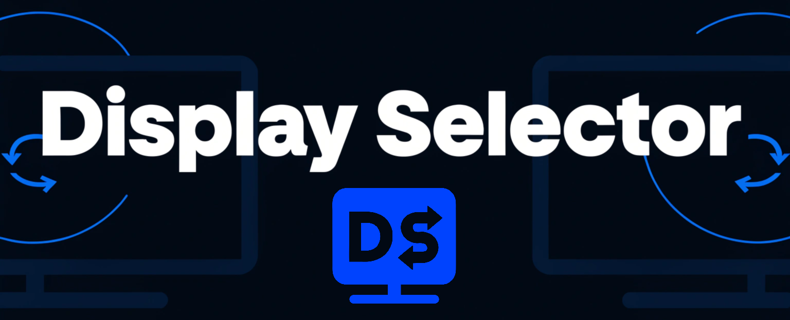

# Display Selector

A lightweight **Windows 11** system-tray utility that captures current **display layout + audio device** as a named `Profile` and binds to a **global hotkey**, enabling switching display and/or sound to a with one keypress.

> [!TIP]
> Yes, **sound** can be switched independently of any **display** profile!

## Why

One PC, several setups — e.g. a multi-monitor desk, a single TV for couch gaming with a soundbar, a single desk monitor with PC speakers. Switching between them in Windows-default tooling means juggling the main display, the sound device, and powering panels on/off.

> [!TIP]
> **Display Selector** makes changes via **one hotkey** while the  application is running

## Features

- Switches the **display configuration** (which monitors are active/extended/duplicated, which is primary, plus resolution and orientation).
- Switches the **audio output device** for apps *and* System Sounds (no more "System Sounds stuck on the old device").
- Plays a **confirmation tone** on the newly-selected device and shows a noptification near the system tray.
- Disconnecting a display in a profile lets that panel drop to low power without having to fully turn off — handy for a multi-to-single monitor (focus mode) transition.
- **Save current settings as a profile** (display + audio), or **save current audio device only** (an audio-only profile that switches just the sound device).
- **Global hotkeys** (default F9–F12; rebindable to any key + Ctrl/Alt/Shift). Conflicts are detected: a combo owned by another app is reported, and combos already used by another profile prompt to reassign.
- **Activate from the tray menu or a hotkey** — works from the desktop or inside an app/game.
- **Manage profiles**: rename, delete (with confirmation), set hotkey, set audio device.
- **Active-profile indicator** in the menu (or *Custom (unsaved)* when nothing matches).
- **Start with Windows** toggle.
- **Diagnostics** submenu: enable debug logging, run an audio test (play a tone per device + confirm), run a display test (see what the tool detects + validate/re-apply), open the log folder, and **submit a bug report / feature request** (opens a pre-filled GitHub issue with your system profile inline and your recent log on the clipboard; the Windows username is redacted).
- **Re-applying the active profile re-asserts the configuration** — the fix for a frozen/stuck Windows display UI.

## Install

Download `DisplaySelectorSetup.exe` from [Releases](https://github.com/funkergreg/display-selector/releases) and run it. It's a **per-user** install (no admin needed). 

> [!NOTE]
> The app is unsigned, so Windows SmartScreen may warn — choose *More info → Run anyway*.

To uninstall: **Settings ▸ Apps ▸ Installed apps ▸ Display Selector ▸ Uninstall**.

Windows-based uninstall removes the app, the *Start with Windows* entry, and **all data** under `%LOCALAPPDATA%\DisplaySelector` (profiles, config, logs).

## Usage

### Initial Setup

1. Run the application (if needed, since it defaults to start with Windows)
2. Arrange your displays + set your audio device the way you want them for a `Profile`
3. **Click the  icon** in the system tray to access the the menu.
    - 
4. **Save current settings as new profile…** → name the `Profile`. It auto-assigns the next free F-key (F9–F12)
    - 

> [!TIP]
> `Run when Windows Starts` is enabled by default after install since this needs to be active in the system tray to work, but this can be turned off in the  menu.

### Hotkeys

Outside the menu, after `Profiles` are created and hotkeys assigned:

1. Press an assigned hotkey to switch to a specific `Profile`.

Hotkeys are accelerators only — everything is reachable from the menu accessible from the system tray.

### Additional Usage Options

- Click a `Profile` to switch to it
  - 
- Use **Manage profiles** to rename, delete, or change a profile's hotkey/audio device
- Click `Run audio test...` to bring up the dialog
  - 
  - Play a sound on the selected device
  - Make a device default for all profiles
  - Switch to the selected device on a specific profile
- If you find anything that could be fixed, submit a bug report...
  - 
  - The application takes you to GitHub and pre-populates a form with debug info

## Build from source

Project is [open-source on GitHub](https://github.com/funkergreg/display-selector).  Building requires the **.NET 10 SDK**.  Building the installer additionally needs [**Inno Setup 6**](https://jrsoftware.org/isdl.php/Inno-Setup-Downloads) on `PATH` or in its default location.

```pwsh
dotnet build                                            # build
dotnet run --project src/DisplaySelector                # run the tray app
dotnet test --filter "Category!=Integration"            # unit tests (headless)
dotnet test --filter "Category=Integration"             # integration tests (real APIs, non-destructive)
powershell -ExecutionPolicy Bypass -File build/build.ps1  # test + publish + compile installer
```

The published app is a self-contained single-file `win-x64` executable — end users need no .NET runtime.

## Data & privacy

Everything is local. Profiles and config are human-readable JSON under `%LOCALAPPDATA%\DisplaySelector`. Nothing is sent anywhere under normal operation, but there are links to GitHub, including the description in `About`, and by explicitly submitting a feature requests and bug reports via the menu, the latter of which does populate info into the form via URL params; all info in the bug report is reviewable before the issue is created. Logs (also local) record settings on save/activation to aid debugging; enable **Diagnostics ▸ Enable debug logging** for verbose detail.

## Notes & limits

- A display that drops HDMI hot-plug-detect when powered off (common with TVs) can't be reached until it's powered on; switching to such a profile is best-effort and reported.
- Setting an audio device that isn't currently available (e.g. a soundbar via a powered-off TV) is kept and applied once the device wakes; the toast says so and the tone is skipped until it's actually active.
- A profile saves the *default output device*, not its **volume level** — switching profiles changes the device, never the volume (by design).
- Audio device switching uses an undocumented Windows API (isolated behind an interface); it's the standard approach for this and may change in future Windows builds.

> Personal-use project, [open-source on GitHub](https://github.com/funkergreg/display-selector). Built and tested on **Windows 11 Pro** only — it's kept portable behind interfaces, but other Windows versions are untested.

## License

Licensed under the **Apache License 2.0** — see [LICENSE](LICENSE). You may use, modify, and
redistribute it, including in derivative works, provided you retain the copyright and attribution
notices (see [NOTICE](NOTICE)). Bundled third-party components are listed in
[THIRD-PARTY-NOTICES.md](THIRD-PARTY-NOTICES.md).

### Trademarks

**"Display Selector"** is the name of this project. The Apache 2.0 license covers the *code*, not the
*name* — per Section 6 it grants no rights to the project name or marks. Please don't use the name
"Display Selector" for derivative works in a way that implies endorsement or origin; give your fork a
distinct name. (Crediting this project as the basis is welcome and required.)

## Credits

- Icons generated at [recraft.ai](https://www.recraft.ai/)
- Code generated by [Claude Code API](https://platform.claude.com/)
- [Claude Code in VS Code](https://marketplace.visualstudio.com/items?itemName=anthropic.claude-code)
- [Community Toolkit](https://github.com/MicrosoftDocs/CommunityToolkit)
- [NAudio](https://github.com/naudio/naudio)
- [Inno Setup 6](https://jrsoftware.org/isdl.php/Inno-Setup-Downloads)

---

## Contributing

Like this project?  It took me $XXX.XX in Claude Code API credits.  Help me cover the cost.

- <https://buymeacoffee.com/funkergreg>


