# Display-Selector

 **Display-Selector** is a lightweight **Windows 11** system-tray utility. It saves your current **display layout + audio device** as a named **Profile**, then switches your whole setup to that Profile with one **global hotkey**, a click in the tray menu, or a double-click on a desktop icon.

**Website:** [display-selector.org](https://display-selector.org) has an overview, screenshots, an install guide, and an FAQ.

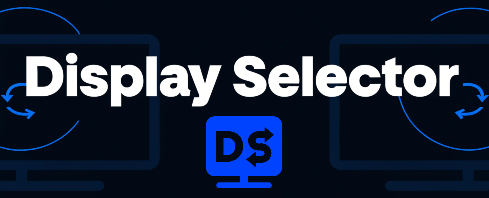

## Features

- **Save your setup as a Profile.** A Profile records which displays are on, which one is primary, and their positions, resolution, orientation and refresh rate. It also records the audio device, all under a name you choose.
- **Audio-only Profiles** switch only the sound device and leave your displays alone. Wherever Profiles are listed, a speaker icon marks audio-only Profiles and a monitor icon marks full Profiles.
- **Switch with one keypress.** A global hotkey works from the desktop or inside a game. The first four Profiles get F9–F12 automatically. You can rebind any of them to any key plus Ctrl/Alt/Shift, and the app checks for clashes between Profiles.
- **Launchers** *(new in 2.0)*: a desktop icon that switches to a Profile, waits for the displays to settle, then starts a game or program. It accepts an `.exe` or a Steam/Epic shortcut, and the TV doesn't even have to be on first.
- **Profile Shortcuts** *(new in 2.0)*: a desktop icon that only switches to a Profile.
- **Profile Manager** *(new in 2.0)*: a window with every Profile command in one place, handy when you're making several changes.
- **Audio follows everywhere.** Apps *and* System Sounds move to the new device, so System Sounds no longer get stuck on the old one.
- **Always knows what's active.** The check mark follows changes made anywhere: Windows Settings, Win+P, the volume flyout, or unplugging a cable. It reacts to Windows change events and never polls.
- **Focus mode**: leave a monitor out of a Profile so it can drop to low power. For example, go from three monitors to one for focused work.
- **Quiet.** It lives in the tray, starts with Windows, and does nothing while idle. Its only sound is a short confirmation tone on the new audio device.

> [!TIP]
> **Sound** can be switched independently of **display**!

## Install & Uninstall

Download the installer `DisplaySelectorSetup.exe` from [Releases](https://github.com/funkergreg/display-selector/releases) and run it. It's a **per-user** install, so no admin rights are needed.

> [!IMPORTANT]
> The app is unsigned, so when Windows SmartScreen warns, choose **More info → Run anyway**.

To uninstall: **Settings ▸ Apps ▸ Installed apps ▸ Display-Selector ▸ Uninstall**.

Uninstalling removes:

- the app
- the *Start with Windows* entry
- **all data** under `%LOCALAPPDATA%\DisplaySelector`: Profiles, config and logs
- the [Launchers and Profile Shortcuts](#launchers-and-profile-shortcuts) it created that are still on the desktop

## Quick start

### 1. Find the tray icon

The app starts in the system tray. Windows 11 often hides new tray icons behind the **^** (*Show hidden icons*) arrow. Drag the  icon onto the taskbar to keep it in view. Left-click or right-click it to open the menu.

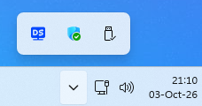

> [!NOTE]
> **Start with Windows** is turned on the first time the app runs, because it has to be running in the tray for hotkeys to work. You can turn it off in the menu.

### 2. Save your first Profile

1. Arrange your displays and pick your audio device the way you want them. **Windows Display Settings…** in the menu opens Windows' own display settings.
2. Open the menu and choose **Save current settings as new Profile…**.

   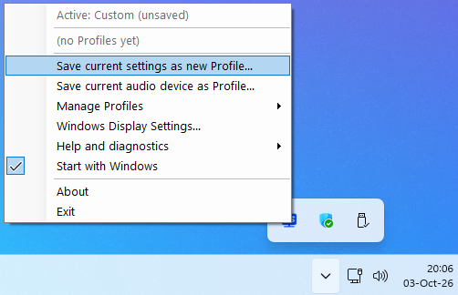

3. Name the Profile (the default is `profile-1`), then choose **OK**.

   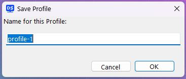

4. The Profile appears in the menu with its hotkey, check-marked as the active one. The menu header names it too.

   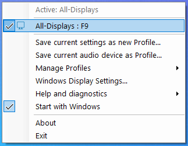

Repeat for each setup you use, such as *Desk*, *TV* or *Desk + TV*. To switch only the sound, choose **Save current audio device as Profile…** instead.

### 3. Switch

Press a Profile's hotkey, or click it in the menu. A notification confirms the switch, and a short tone plays on the new audio device once it's ready. Notifications are silent; the tone is the only sound the app makes.

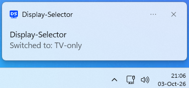

If that Profile is already in effect, nothing is re-applied: no screen blackout and no tone.

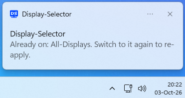

Switch to it again within about 5 seconds to force a full re-apply. This also unsticks a frozen Windows display UI.

### 4. Change a hotkey

Choose **Manage Profiles ▸ *(Profile)* ▸ Set hotkey…**, press the key combination, then choose **OK**. **Clear Hotkey** removes it.

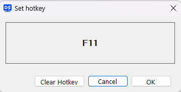

If another Profile already uses that combination, the app asks whether to move it:

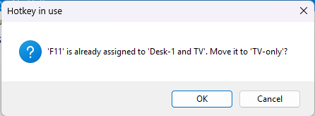

### 5. Make a Launcher for a game

1. Click **Manage Profiles** to open the [Profile Manager](#profile-manager), then choose **Create a Launcher for Profile…** on its bottom bar.
2. Pick the game's `.exe`. For a Steam or Epic game, pick the desktop shortcut that Steam or Epic created (a `.url` file).
3. Choose the Profile the Launcher should switch to:

   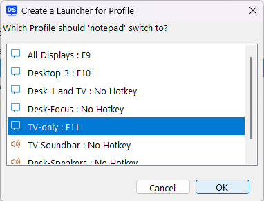

4. Check the **Launcher name**, add optional [Arguments](#launchers-and-profile-shortcuts), then choose **Create**:

   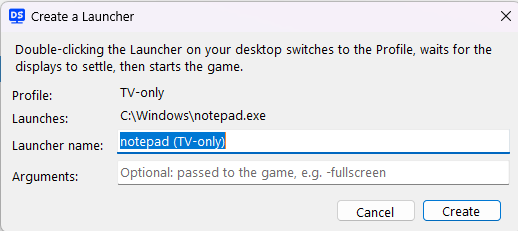

5. The Launcher appears on your desktop with the program's own icon. Profile Shortcuts use the Display-Selector icon.

   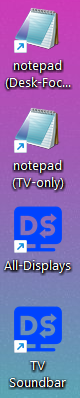

6. Double-click the Launcher. Display-Selector switches to the Profile, waits for the displays to settle, then starts the program:

   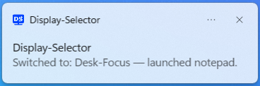

Each Profile's own submenu, and the right side of the Profile Manager, also have **Create a Launcher…** for that Profile. Those skip step 3.

## Reference

### Tray menu

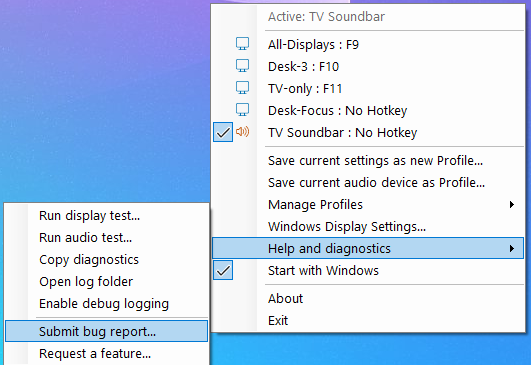

The header shows the active Profile, or *Custom (unsaved)* when no Profile matches. The tray icon's tooltip shows the same name. Every capability is reachable from this menu; hotkeys are only shortcuts for switching.

| Item | What it does |
| --- | --- |
| *Profile list* | Click a Profile to switch to it. The check mark shows the active one. A monitor icon marks full Profiles, a speaker icon marks audio-only Profiles. |
| **Save current settings as new Profile…** | Saves the current displays and audio device as a new Profile. |
| **Save current audio device as Profile…** | Saves an audio-only Profile, which switches only the sound device. |
| **Manage Profiles** | Hover for a submenu per Profile. Click it to open the [Profile Manager](#profile-manager). |
| **Windows Display Settings…** | Opens Windows' **Settings ▸ System ▸ Display**. |
| **Help and diagnostics** | Testers, diagnostics, logs, and bug reports. See [Help and diagnostics](#help-and-diagnostics). |
| **Start with Windows** | Starts the app automatically when you sign in (on by default). |
| **About** | Version, links, and author. See [About](#about). |
| **Exit** | Quits the app. Hotkeys stop working until it runs again. A Launcher or Profile Shortcut starts it again. |

### Manage Profiles

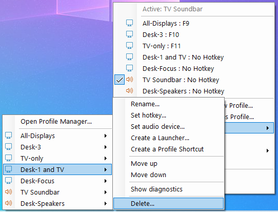

Each Profile has its own submenu:

- **Rename…**
- **Set hotkey…**: see [Change a hotkey](#4-change-a-hotkey).
- **Set audio device…**: opens the [Audio Device Setter](#audio-device-setter). If the Profile is active, it switches to the new device straight away, so the Profile stays active.
- **Create a Launcher…** and **Create a Profile Shortcut**: see [Launchers and Profile Shortcuts](#launchers-and-profile-shortcuts).
- **Move up** / **Move down**: changes the Profile order, which is also the menu order.
- **Show diagnostics**: opens [Profile Diagnostics](#profile-diagnostics).
- **Delete…**: see [Deleting a Profile](#deleting-a-profile).

### Profile Manager

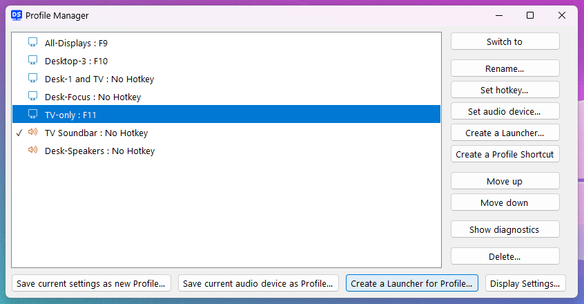

Open it by clicking **Manage Profiles**, or by choosing **Open Profile Manager…** at the top of its submenu. It's the same set of commands as the menu, in one window that can stay open while you work.

- **Left:** your Profiles, in the same order and with the same icons as the tray menu. The active one is check-marked.
- **Right:** commands for the selected Profile. **Switch to** switches to it; double-clicking it or pressing Enter does the same.
- **Bottom:** **Save current settings as new Profile…**, **Save current audio device as Profile…**, **Create a Launcher for Profile…**, and **Display Settings…**.

Each Display-Selector window opens only once. Choosing it again brings the open window to the front. This applies to the Profile Manager, Profile Diagnostics, both testers, and About.

#### Profile Diagnostics

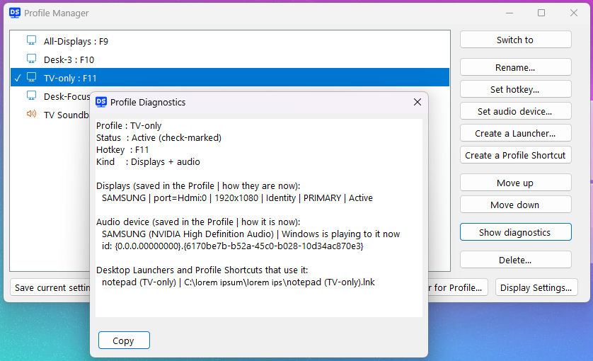

**Show diagnostics** describes one Profile: its hotkey, its saved displays, its audio device, and the desktop Launchers and Profile Shortcuts that use it.

- Each saved display and audio device appears next to how it is right now. A display is *Active*, *Connected, not in use*, or *Not connected*. An audio device is *Windows is playing to it now*, *Available*, or *Not available (off or unplugged)*.
- The window follows the Profile you select in the Profile Manager, and it updates when your displays or audio change.
- **Copy** puts the text on the clipboard.

### Launchers and Profile Shortcuts

A **Launcher** is a desktop icon that switches to a Profile, then starts a game or any program, in one double-click. For example, you can switch to the TV and start a game from the couch. A **Profile Shortcut** only switches to the Profile.

**To create one:**

- **Create a Launcher…**, from a Profile's submenu or the Profile Manager's right side: pick the program, then confirm the details.
- **Create a Launcher for Profile…**, on the Profile Manager's bottom bar: pick the program first, then the Profile. See [Make a Launcher for a game](#5-make-a-launcher-for-a-game).
- **Create a Profile Shortcut**, from a Profile's submenu or the Profile Manager: a shortcut named after the Profile appears on the desktop straight away, with no dialog. It's handy from the couch with just a mouse, as a Steam Big Picture tile, or pinned to Start or the taskbar.

**Arguments** are passed to the program when it starts, exactly as you'd type them after the program name in a command prompt. Use them for the game's own options, such as `-fullscreen`, `-dx11` or `-skipintro`. Which options exist depends on the game, so check its documentation or community wiki. Leave the field empty if you don't need any. Steam and Epic `.url` shortcuts usually ignore Arguments; set launch options in Steam or Epic instead.

**When you double-click a Launcher:**

- Display-Selector switches to the Profile. It then waits up to about 10 seconds for the displays to finish changing, so the game opens on the right screen.
- If the app isn't running, the Launcher starts it, and it stays in the tray afterwards.
- If the Profile is already in effect, the game starts straight away.
- The game always starts, even if something didn't switch. The notification says what went wrong.

Good to know:

- **The TV doesn't have to be on first.** Double-click the Launcher, then turn the TV on within about 10 seconds. Display-Selector waits for the TV to appear, switches to the Profile again so the picture and sound move onto it, then starts the game. If the TV doesn't come on in time, the game starts anyway, and the notification says which display was missing.
- Renaming a Profile doesn't break its Launchers.
- If a Launcher's Profile has been deleted, the Launcher says so and still starts the game.
- You can move or copy a Launcher anywhere. For example, pin it to Start, or add it to Steam as a non-Steam game.
- Uninstalling removes the Launchers and Profile Shortcuts Display-Selector created, as long as they're still where it put them. Ones you moved or renamed, and shortcuts you made yourself, are left alone.

**Command line**, for hand-made shortcuts, Steam's *Add a Non-Steam Game*, Playnite, and so on:

```text
DisplaySelector.exe --profile "<profile name or id>" [--launch "<program, shortcut, or link>"] [--args "<arguments for it>"]
```

```text
"%LOCALAPPDATA%\Programs\Display-Selector\DisplaySelector.exe" --profile "Living Room TV" --launch "steam://rungameid/570"
```

### Deleting a Profile

**Delete…** asks you to confirm. If Launchers or Profile Shortcuts on the desktop use the Profile, it lists them and offers to delete them too:

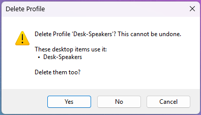

- **Yes** deletes the Profile and those desktop items.
- **No** deletes only the Profile.
- **Cancel** keeps everything.

### Audio

#### Audio Device Setter

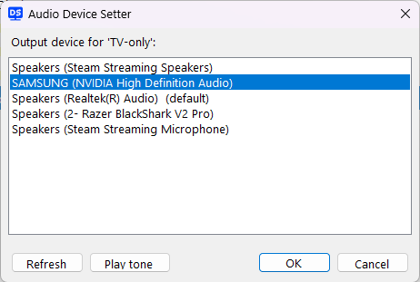

**Set audio device…** picks the device a Profile switches to.

- **Refresh** picks up a device you just turned on.
- **Play tone** plays a test tone on the selected device, without changing the Windows default, so you can tell which device is which.
- Only devices Windows can see right now are listed. A soundbar on a TV often only appears while the TV is in use as a display. Switch to a Profile that uses the TV first, then set the soundbar.

#### Audio Tester

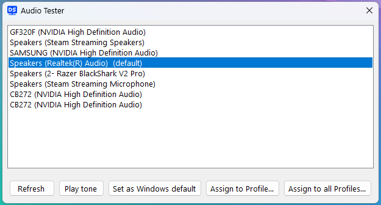

Open it from **Help and diagnostics ▸ Run audio test…**. It lists every output device, and the current Windows default is marked *(default)*. The list updates when the default device changes or a device comes or goes.

- **Refresh** and **Play tone** work as in the Audio Device Setter.
- **Set as Windows default** makes the selected device the default for all apps *and* System Sounds. It asks first.
- **Assign to Profile…** gives one Profile the selected device.
- **Assign to all Profiles…** gives every full Profile the selected device in one go. Audio-only Profiles keep their own device.

### Displays

#### Display Tester

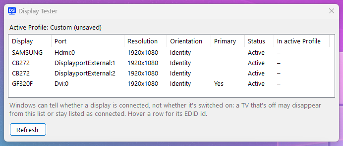

Open it from **Help and diagnostics ▸ Run display test…**. It lists every connected display: its port, resolution, orientation, and whether it's primary.

- **Status** is *Active* (showing desktop) or *Connected, not in use*.
- **In active Profile** shows whether the active Profile uses the display.
- Hover over a row to see the display's EDID id.
- The table updates when displays change or are plugged in or out. **Refresh** re-reads it on demand.

Windows can tell whether a display is *connected*, not whether it's switched *on*. A TV that's off may vanish from the list, or stay listed as connected.

### Help and diagnostics

- **Run display test…**: see the [Display Tester](#display-tester).
- **Run audio test…**: see the [Audio Tester](#audio-tester).
- **Copy diagnostics**: copies the app version, Windows version, active Profile, graphics adapters, displays and audio devices to the clipboard. `[x]` marks what's in use right now, for example:

  ```text
  Active Profile : TV-only

  Displays ([x] = showing desktop now, [ ] = connected, not in use):
    [x] SAMSUNG | port=Hdmi:0 | 1920x1080 | Identity | PRIMARY

  Audio output devices ([x] = Windows is playing to it now):
    [x] SAMSUNG (NVIDIA High Definition Audio) | {0.0.0.00000000}.{…}
    [ ] Speakers (Realtek(R) Audio) | {0.0.0.00000000}.{…}
  ```

- **Open log folder**
- **Enable debug logging**: turns on verbose logging, to help diagnose a problem.
- **Submit bug report…**: opens a *pre-filled* GitHub issue with your diagnostics and the latest log lines. It also copies your recent log to the clipboard, and opens the log folder, so you can paste the log or drag the file in.

  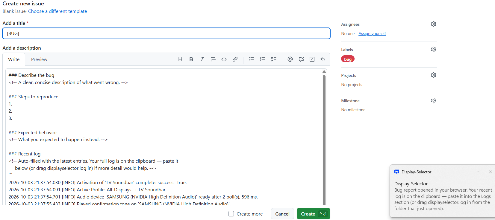

- **Request a feature…**: opens a pre-filled GitHub feature request.

### About

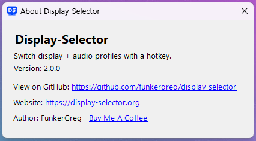

About shows the version, with links to the [project on GitHub](https://github.com/funkergreg/display-selector), [display-selector.org](https://display-selector.org) and [Buy Me A Coffee](https://buymeacoffee.com/funkergreg). Close it with Esc or ✕.

## Build from source

The project is [open-source on GitHub](https://github.com/funkergreg/display-selector). Building it requires the **.NET 10 SDK**. Building the installer also needs [**Inno Setup 6**](https://jrsoftware.org/isdl.php/Inno-Setup-Downloads), either on `PATH` or in its default location.

```pwsh
dotnet build                                            # build
dotnet run --project src/DisplaySelector                # run the tray app
dotnet test --filter "Category!=Integration"            # unit tests (headless)
dotnet test --filter "Category=Integration"             # integration tests (real APIs, non-destructive)
powershell -ExecutionPolicy Bypass -File build/build.ps1  # test + publish + compile installer
```

The published app is a self-contained `win-x64` build (bundled runtime, loose files), so end users don't need a .NET runtime.

## Data & privacy

**Everything stays on your machine.** Your Profiles, config, and logs are human-readable files under `%LOCALAPPDATA%\DisplaySelector`, and the app sends nothing over the network on its own. To make problems easier to diagnose, the logs record your settings each time a Profile is saved or activated. For more detail, turn on **Help and diagnostics ▸ Enable debug logging**.

The only outbound actions are ones you start yourself:

- **About** (and a couple of other menu items) opens links to this project in your browser: its [GitHub repo](https://github.com/funkergreg/display-selector) and [display-selector.org](https://display-selector.org).
- **Submit bug report… / Request a feature…** opens a *pre-filled* GitHub issue. A bug report includes your system diagnostics and copies your recent log to the clipboard, with your Windows user name replaced by `%USER%`. Nothing is public until you review the issue and submit it on GitHub.

> [!NOTE]
> **Copy diagnostics** and Profile Diagnostics' **Copy** are *not* redacted. For example, a Launcher's path includes your Windows user name. Check the text before you paste it anywhere public.

## Notes & limits

- **TVs that are switched off.** A display that drops HDMI hot-plug-detect when powered off (common with TVs) can't be reached until it's powered on. Switching to a Profile that uses it is best-effort, and the notification reports what's missing. [Launchers](#launchers-and-profile-shortcuts) wait about 10 seconds for it to come on; a hotkey or menu switch doesn't wait, so switch again once the TV is on.
- **Slow audio devices.** If an audio device doesn't become available within about 10 seconds of a switch (for example, a soundbar on a TV that's still off), a notification reports it and no tone plays. Turn the device on, then switch again. If Windows hands the default to a newly connected device during a switch, Display-Selector sets the Profile's device back.
- **Hotkeys another app already uses.** If another app already owns a key (Steam often uses F12, for example), Display-Selector can't use it. The notification tells you when you save the Profile or set the hotkey, so you can pick a different combination.
- **Device output, not volume.** A Profile saves the **output device**, not its *volume level*. Switching Profiles changes the device and never touches the volume.
- **A chime when the TV comes on.** If you hear a chime as a TV turns on, that's Windows' own *Device Connect* sound, not Display-Selector. You can change it under **Control Panel ▸ Sound ▸ Sounds**.
- **Ties between Profiles.** When two Profiles match the current setup equally, the one higher in the list gets the check mark. Use **Move up** / **Move down** to choose which one.
- **Undocumented audio API.** Audio device switching uses an undocumented Windows API, isolated behind an interface. It's the standard approach for this, but it may change in future Windows builds.

> [!IMPORTANT]
> This originated as a personal-use project, [open-sourced to GitHub](https://github.com/funkergreg/display-selector). It has been built and tested on **Windows 11 Pro** only. It's kept portable behind interfaces, but other Windows versions are untested. Software is provided as-is, with no guarantees of functionality on your system or future updates.

## License

Licensed under the **Apache License 2.0**; see [LICENSE](LICENSE). You may use, modify, and redistribute it, including in derivative works, provided you retain the copyright and attribution notices (see [NOTICE](NOTICE)). Bundled third-party components are listed in [THIRD-PARTY-NOTICES.md](THIRD-PARTY-NOTICES.md).

### Trademarks

**"Display-Selector"** is the name of this project. The Apache 2.0 license covers the *code*, not the *name*: per Section 6, it grants no rights to the project name or marks. Please don't use the name "Display-Selector", with or without the dash, for derivative works in a way that implies endorsement or origin. Give your fork a distinct name. (Crediting this project as the basis is welcome and required.)

## Credits

- Built with [Claude Code](https://claude.com/claude-code)
- Icons generated at [recraft.ai](https://www.recraft.ai/)
- [Community Toolkit](https://github.com/MicrosoftDocs/CommunityToolkit)
- [NAudio](https://github.com/naudio/naudio)
- [Inno Setup 6](https://jrsoftware.org/isdl.php/Inno-Setup-Downloads)

---

## Support

If  **Display-Selector** is useful to you, consider helping cover the cost of the Claude Code API credits used to create it.

- <https://buymeacoffee.com/funkergreg>


