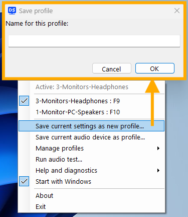
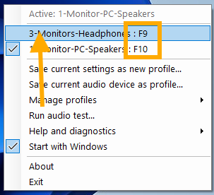
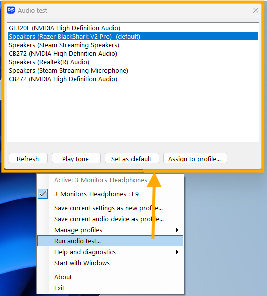

# Display-Selector

 **Display-Selector** is a lightweight **Windows 11** system-tray utility that captures your current **display layout + audio device** as a named `Profile` and binds it to a **global hotkey** — switching displays, sound, or both with one keypress.

**Website:** [display-selector.org](https://display-selector.org) — overview, screenshots, install guide, and FAQ.


## Features

- **Capture your current setup as a `Profile`** — the display layout (which monitors are active, which is primary, plus resolution and orientation) *and* the current audio device, saved under a name you choose.
- **Audio-only `Profile`(s)** — switch just the sound device, independent of any other changes.
- **Hotkeys and Shortcuts**
  - **Switch with one keypress** — a global hotkey (or the tray menu) rearranges your displays and changes the audio device in a single step; works from the desktop or inside an app/game.
  - **Switch via clicking Desktop link** -- Activate a  `Profile` via a Windows Desktop shortcut; usable and re-configurable like normal Windows Desktop shortcuts
- **Launchers** — a desktop Launcher that switches to a `Profile` and then starts an application (a game, an exe, or a Steam/Epic desktop shortcut), waiting for the displays to settle so the game opens on the correct main display for the `Profile`.
- **Audio follows everywhere** — apps *and* System Sounds move to the new device (no more "System Sounds stuck on the old one").
- **Rebindable global hotkeys** — F9–F12 by default, remappable to any key + Ctrl/Alt/Shift, with conflict detection.
- **Focus mode** — leave a panel out of a `Profile` to let it drop to low power, e.g. switch from a multi-monitor to single-monitor focus.
- **Lives in the system tray** — optionally starts with Windows; the active `Profile` shows in the menu, and every action is reachable via the system tray menu.

> [!TIP]
> **Sound** can be switched independently of **display**!

## Install & Uninstall

Download the installer `DisplaySelectorSetup.exe` from [Releases](https://github.com/funkergreg/display-selector/releases) and run it. It's a **per-user** install (no admin needed).

> [!IMPORTANT]
> The app is unsigned, so when Windows SmartScreen warns, choose **More info → Run anyway**.

To uninstall: **Settings ▸ Apps ▸ Installed apps ▸ Display-Selector ▸ Uninstall**.

Windows-based uninstall removes the app, the *Start with Windows* entry, and **all data** under `%LOCALAPPDATA%\DisplaySelector` including `Profile`(s), config, and logs. It also removes the [Launchers and Profile Shortcuts](#game-launchers) it created that are still on the desktop.

## Usage

### Initial Setup

> [!NOTE]
> **Start with Windows** is enabled by default on install since the app needs to be running in the system tray to work, but this can be turned off from the  menu.

1. Run the application (if not already running)
2. Arrange your displays + set your audio device the way you want them for a `Profile`
3. **Click the  icon** in the system tray to access the menu.
    - 
4. **Save current settings as new Profile…** → name the `Profile`. It auto-assigns the next free F-key (F9–F12) for the first four.
    - 
5. Repeat steps 2-4 for other profiles, as necesessary

### Hotkeys

Outside the menu, after `Profiles` are created and hotkeys assigned:

1. Press an assigned hotkey to switch to a specific `Profile`.  A notification near the system tray will confirm.

### Additional Usage

The active `Profile` is checked and named at the top of the menu (or *Custom (unsaved)* when nothing matches). Every capability below is reachable from the tray menu — hotkeys are only accelerators for switching.

- **Switch profiles** — click a `Profile` in the menu, or press its hotkey.
  - 
  - If that `Profile` is already in effect (same displays, resolution, orientation and audio device), nothing is re-applied and the toast says *Already on*. Switch to it again within a few seconds to force a full re-apply, which also unsticks a frozen Windows display UI.
  - The confirmation tone plays on the new audio device once it's actually ready. A TV's HDMI sound only appears after the TV picture comes on, so the app waits up to about 10 seconds for it. If Windows grabs the default for a newly arrived device during that time, the app sets the `Profile`'s device back.
- **Save current audio device as Profile…** — create an *audio-only* `Profile` that switches just the sound device and leaves your displays untouched.
- **Manage Profiles** — hover for a per-profile submenu to **Rename…**, **Set hotkey…** (or clear it), **Set audio device…**, **Create a Launcher…** / **Create a Profile Shortcut** (see [Game Launchers](#game-launchers)), reorder with **Move up** / **Move down** (this is also the menu order), or **Delete…**.
  - **Set audio device…** on the active `Profile` switches to the new device straight away, so the `Profile` stays active.
  - **Delete…** also offers to remove that `Profile`'s Launchers and Profile Shortcuts from the desktop.
  - **Click** *Manage Profiles* (or choose **Open Profile Manager…** at the top of its submenu) to open the **Profile Manager** window. It lists your `Profiles` on the left, exactly as in the tray menu, with the active one check-marked. The right side has the same commands for the selected `Profile`, plus **Switch to** (or double-click a `Profile`). Along the bottom are **Save current settings as new Profile…**, **Save current audio device as Profile…** and **Create a Launcher for Profile…**.
  - Opening a window that's already open (Profile Manager, About, or the audio/display tests) brings that window to the front instead of opening a second copy. The test windows can stay open while you save or switch `Profiles`.
- **Run audio test…** — brings up the audio dialog:
  - 
  - **Play tone** on the selected device
  - **Set as default** — make the device the system default for all apps *and* System Sounds
  - **Assign to Profile…** — attach the selected device to an existing `Profile`
- **Start with Windows** — toggle launching the app automatically when you sign in (on by default).
- **Help and diagnostics** submenu:
  - **Run display test…** — see the displays the app detects, then **Validate** the layout or **Re-apply** it (re-applying is also the fix that unsticks a frozen Windows display UI)
  - **Copy diagnostics** — copy the detected displays + audio devices to the clipboard
  - **Open log folder**
  - **Enable debug logging** — verbose logging to help diagnose a problem
  - **Submit bug report…** — opens a *pre-filled* GitHub issue with debug info; your most recent log is copied to the clipboard to paste in
    - 
  - **Request a feature…** — opens a pre-filled GitHub feature request
- **About** — shows the version, with links to the [project on GitHub](https://github.com/funkergreg/display-selector) and [display-selector.org](https://display-selector.org).
- **Exit** — quits the app; hotkeys stop working until it's launched again.

### Game Launchers

A Launcher is a desktop icon that switches to a `Profile` and then starts a game (or any program) in one double-click. For example, switch to the TV and start a game from the couch.

1. Create one in either of these ways:
   - **Manage Profiles ▸ *(profile)* ▸ Create a Launcher…**, or **Create a Launcher…** in Profile Manager's right-hand commands, for the selected `Profile`.
   - **Create a Launcher for Profile…** on Profile Manager's bottom bar: pick the game first, then choose which `Profile` it should switch to.
2. In the file chooser, pick the game's `.exe`, or an existing shortcut. For Steam/Epic games, pick the desktop shortcut Steam or Epic created (a `.url` file).
3. Confirm the **Launcher name** and optional **Arguments**, then choose **Create**. The Launcher appears on your desktop.
   - **Arguments** are passed to the game when it starts, exactly as you'd type them after the program in a command prompt. Use them for the game's own options, e.g. `-fullscreen`, `-dx11` or `-skipintro`. Which options exist depends on the game, so check its documentation or community wiki. Leave the field empty if you don't need any. Steam/Epic `.url` shortcuts usually ignore Arguments; set launch options in Steam or Epic instead.
4. Double-click it. Display-Selector switches `Profiles`, waits for the displays to finish changing (up to about 10 seconds) so the game opens on the right screen, then starts the game. If the app isn't running yet, the Launcher starts it. If the `Profile` is already in effect, the game starts straight away.

**Profile Shortcuts:** choose **Create a Profile Shortcut** (per `Profile`, in the tray submenu or Profile Manager) and a shortcut named after the `Profile` appears on your desktop straight away. It only switches to the `Profile`: there's no file to pick and nothing is launched. It's handy from the couch with just a mouse, as a Steam Big Picture tile, or pinned to Start or the taskbar.

Good to know:

- **The TV doesn't have to be on first.** Double-click the Launcher, then turn the TV on within about 10 seconds. Display-Selector waits for the TV to appear, switches to the `Profile` again so the picture (and sound) moves onto it, then starts the game. If the TV doesn't come on in time, the game starts anyway and the toast says which display was missing.
- Renaming the `Profile` doesn't break its Launchers. Deleting a `Profile` offers to delete its Launchers and Profile Shortcuts too; any left behind warn that the `Profile` is gone, and a Launcher still starts the game.
- You can move or copy a Launcher anywhere, e.g. pin it to Start or add it to Steam Big Picture as a non-Steam game.
- Uninstalling removes the Launchers and Profile Shortcuts Display-Selector created that are still where it put them. Ones you moved, or shortcuts you made yourself, are left alone.

**Command line** (for hand-made shortcuts, Steam's *Add a Non-Steam Game*, Playnite, etc.):

```text
DisplaySelector.exe --profile "<profile name or id>" [--launch "<program, shortcut, or link>"] [--args "<arguments for it>"]
```

```text
"%LOCALAPPDATA%\Programs\Display-Selector\DisplaySelector.exe" --profile "Living Room TV" --launch "steam://rungameid/570"
```

## Build from source

Project is [open-source on GitHub](https://github.com/funkergreg/display-selector).  Building requires the **.NET 10 SDK**.  Building the installer additionally needs [**Inno Setup 6**](https://jrsoftware.org/isdl.php/Inno-Setup-Downloads) on `PATH` or in its default location.

```pwsh
dotnet build                                            # build
dotnet run --project src/DisplaySelector                # run the tray app
dotnet test --filter "Category!=Integration"            # unit tests (headless)
dotnet test --filter "Category=Integration"             # integration tests (real APIs, non-destructive)
powershell -ExecutionPolicy Bypass -File build/build.ps1  # test + publish + compile installer
```

The published app is a self-contained `win-x64` build (bundled runtime, loose files) — end users need no .NET runtime.

## Data & privacy

**Everything stays on your machine.** Your `Profile`(s), config, and logs are human-readable files under `%LOCALAPPDATA%\DisplaySelector`, and the app sends nothing over the network on its own.  Logs record your settings each time a `Profile` is saved or activated, to make problems easier to diagnose. For more detail, turn on **Help and diagnostics ▸ Enable debug logging**.

The only outbound actions are ones you start yourself:

- **About** (and a couple of other menu items) open links to this project — its [GitHub repo](https://github.com/funkergreg/display-selector) and [display-selector.org](https://display-selector.org) — in your browser.
- **Submit a bug report / feature request** opens a *pre-filled* GitHub issue. A bug report inlines your system vitals and copies your most recent log to the clipboard, with your Windows username redacted. Nothing is public until you review the issue and submit it on GitHub.

## Notes & limits

- A display that drops HDMI hot-plug-detect when powered off (common with TVs) can't be reached until it's powered on; switching to such a `Profile` is best-effort and reported. [Game Launchers](#game-launchers) wait about 10 seconds for it to come on; a hotkey or menu switch doesn't wait, so press it again once the TV is on.
- An audio device that doesn't become available within about 10 seconds of a switch (e.g. a soundbar on a TV that's still off) is reported in a toast, and no tone plays. Turn it on, then switch again.
- A profile saves the **output device**, not its *volume level* — switching profiles changes the device, never the volume (by design).
- Audio device switching uses an undocumented Windows API (isolated behind an interface); it's the standard approach for this and may change in future Windows builds.

> [!IMPORTANT]
> This originated as a personal-use project, [open-sourced to GitHub](https://github.com/funkergreg/display-selector). It has been built and tested on **Windows 11 Pro** only — it's kept portable behind interfaces, but other Windows versions are untested.  Software is provided as-is, with no guarantees of functionality on your system or future updates.

## License

Licensed under the **Apache License 2.0** — see [LICENSE](LICENSE). You may use, modify, and redistribute it, including in derivative works, provided you retain the copyright and attribution notices (see [NOTICE](NOTICE)). Bundled third-party components are listed in
[THIRD-PARTY-NOTICES.md](THIRD-PARTY-NOTICES.md).

### Trademarks

**"Display-Selector"** is the name of this project. The Apache 2.0 license covers the *code*, not the *name* — per Section 6 it grants no rights to the project name or marks. Please don't use the name "Display-Selector", with or without the dash, for derivative works in a way that implies endorsement or origin; give your fork a distinct name. (Crediting this project as the basis is welcome and required.)

## Credits

- Built with [Claude Code](https://claude.com/claude-code)
- Icons generated at [recraft.ai](https://www.recraft.ai/)
- [Community Toolkit](https://github.com/MicrosoftDocs/CommunityToolkit)
- [NAudio](https://github.com/naudio/naudio)
- [Inno Setup 6](https://jrsoftware.org/isdl.php/Inno-Setup-Downloads)

---

## Support

If  **Display-Selector** is useful to you, consider helping cover the cost of the Claude Code API credits used to create it.

- <https://buymeacoffee.com/funkergreg>


